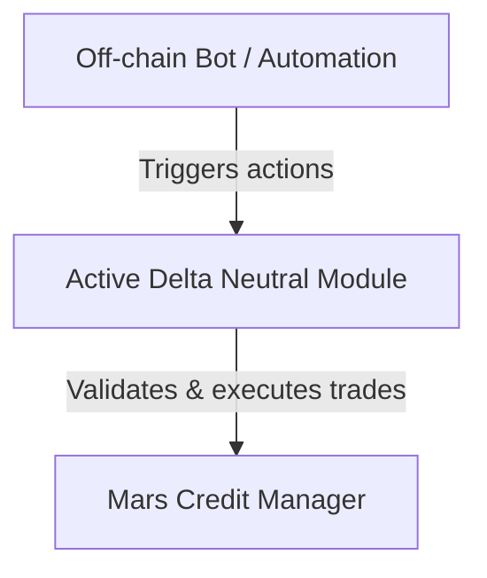

# Active Delta Neutral Module

## Overview

The Active Delta Neutral Module is a smart contract system designed to enable delta-neutral strategies inside of a credit account on Mars.

This module provides automated position rebalancing, efficient entry and exit mechanisms, and robust risk management features. It is suitable for users and protocols seeking stable, market-neutral returns in decentralized finance (DeFi) environments.

The strategy is a carry trade: the module sells one asset (e.g USDC), borrows another asset (e.g WBTC), and simultaneously takes offsetting perp positions (e.g long spot, short perp). This allows users to capture the net yield between the spot yield (e.g lending rate) and perp funding while remaining neutral to price movements.

## Architecture

### 1. High-Level Design

The Active Delta Neutral Module is structured as a smart contract that operates a credit account within Mars. It orchestrates a sequence of actions to establish and maintain delta-neutral carry trade positions. The system automates asset borrowing, spot and perpetual trading, and ongoing position rebalancing to ensure market neutrality and optimal yield capture.

On instantiation, the module creates its own dedicated credit account through the Mars Credit Manager. All actions—including collateral deposits, asset borrowing, trading, and lending performed entirely within this credit account, ensuring isolated and secure strategy execution.

The module is designed for permissionless execution: any off-chain bot or automation service can trigger rebalancing, entry, exit, or risk management actions. This ensures the strategy remains up-to-date and responsive to market conditions without relying on a single operator, promoting decentralization and continuous operation.

The actual trades are calculated off chain by a bot and sent to the contract, which validates the trades and executes them if they meet the requirements.

### 4. Position Management & Execution

#### 4.1 Trade Execution Flow
- Overview of how trade instructions are received and processed

#### 4.2 Trade Validation
- Checks performed before executing trades (e.g., risk, price limits, position limits)

#### 4.3 Increasing Position Size
- Logic and steps for increasing exposure (adding to an existing position)

#### 4.4 Decreasing Position Size
- Logic and steps for reducing exposure (partially closing a position)

#### 4.5 Flipping Position Direction
- Handling a full unwind and reversal (e.g., from net long to net short)

#### 4.6 Liquidation & Forced Close
- How the system responds to risk threshold breaches or liquidation events

#### 4.7 Atomicity & State Consistency
- Ensuring all actions are executed atomically within the credit account

### 5. Rebalancing Logic

### 6. Risk Management

### 7. External Integrations

## Key Concepts

## Entry & Exit Model

## Parameters

## Usage Examples

## Testing

## Security Considerations

## References

## Changelog
