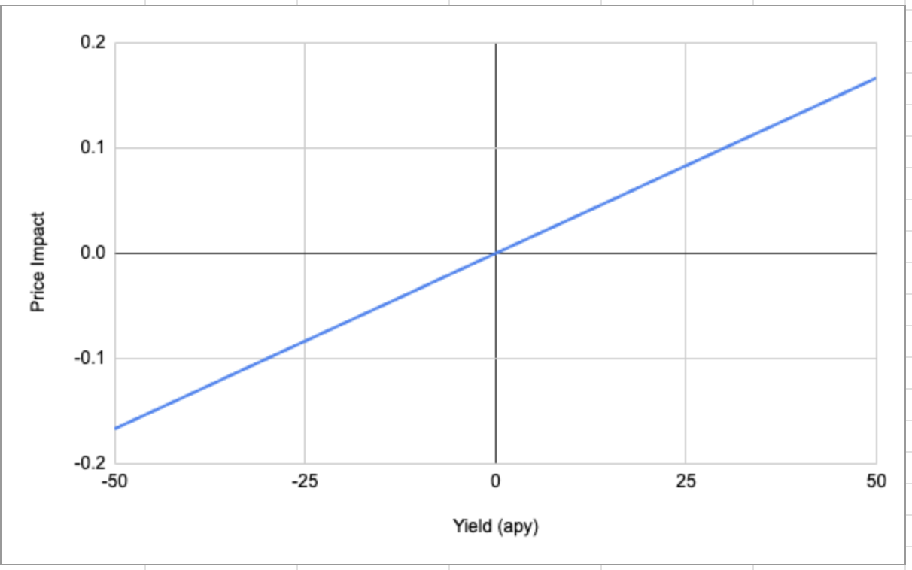
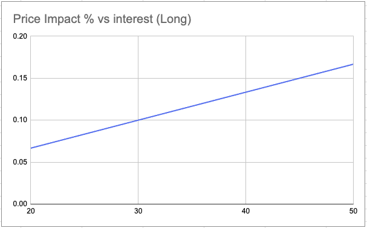
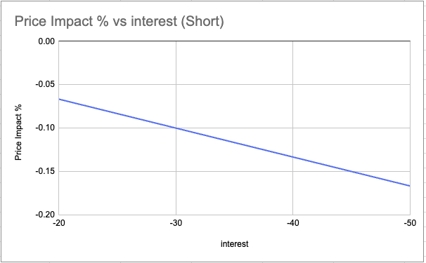

# Delta-Neutral Entry/Exit Model

This document describes a simple entry/exit model for delta-neutral trading strategies. It provides guidance on when to enter or exit positions based on price execution, funding rates, borrowing costs, supply rates.

## Key Concepts

- **Price PnL**: The price difference between the spot and perpetual (perp) markets.
  - **Long Position**: Short perp - Long spot (positive when shorts are higher).
  - **Short Position**: Short spot - long Perp (positive when spot is higher).

- **Net yield**: The net cost or yield after considering all funding rates and borrow/supply rates.
- **`K`** A constant that controls the sensitivity of the entry/exit model. The higher the value of `K`, the less sensitive the model is to price impact. 

## Entry and Exit Criteria

- If funding rates are low (no yield), only adjust positions when the price pnl is favorable.
- The maximum acceptable price pnl is determined by the interest rate environment.
- The entry threshold uses a linear equation:

  ```
  Limit Price PnL = Net Yield / K
  ```

  - `K` controls the sensitivity of the threshold.
  - Short positions (short spot, long perp) can only be executed when net yield is below 0.
  - Long positions (long spot, short perp) can only be executed when net yield is above 0.

## Funding Rate Calculations

- **Long (No Leverage):**  
  `Total Funding Rate = Funding Rate - USDC Supply Rate`
- **Long (With Leverage):**  
  `Total Funding Rate = Funding Rate - USDC Borrow Rate`
- **Short: (No Leverage)**  
  `Total Funding Rate = |Funding Rate| - Spot supply Rate`
- **Short: (With Leverage)**  
  `Total Funding Rate = |Funding Rate| - Spot Borrow Rate`

No leverage trades occur when we have the spot asset in our account to sell, while leverage trades occur when we borrow the asset to sell it.

## Calculating Net Yield

Net yield determines whether a position is expected to be profitable based on funding and borrowing costs. The calculation differs for long and short positions:

- **Long Position (Long Spot, Short Perp):**
  - *No Leverage*: 
    - **Net Yield = Perp Funding Rate - Spot Supply Rate difference**
    - You earn the perp funding rate and the spot supply rate difference.
  - *With Leverage*: 
    - **Net Yield = Perp Funding Rate - Spot Borrow Rate difference**
    - You pay to borrow the spot asset used to purchase spot, and earn the perp funding rate. Usually, the spot asset is USDC, but sometimes (in negative funding rate environments it could be the volatile assets)

- **Short Position (Short Spot, Long Perp):**
  - **Net Yield = |Perp Funding Rate| - Spot Borrow Rate**
  - You pay to borrow the spot asset and receive (or pay) the perp funding rate, depending on its sign.
  - If the perp funding rate is negative, you must pay it; if positive, you earn it. The net yield calculation reflects this by using the absolute value.

A positive net yield means the position is expected to generate income over time, while a negative net yield indicates a cost to hold the position.

## Model Example

In the following chart we can see how the model works. Everything above the line when the yield rate is above 0 , is a signal to long.

Everything below the trend line when the yield rate is below 0 is a signal to short.




Possible alternative model could have a base that is not 0, and have individual distinct models for long and short.

Again, for longs everything below the line is a signal to long. For the short size, everything above the line is a signal to short.

 

## Usage Notes

- Adjust `K` to tune the aggressiveness of the model.